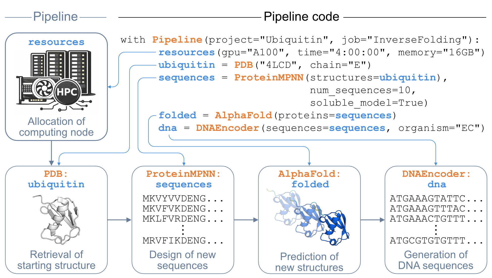
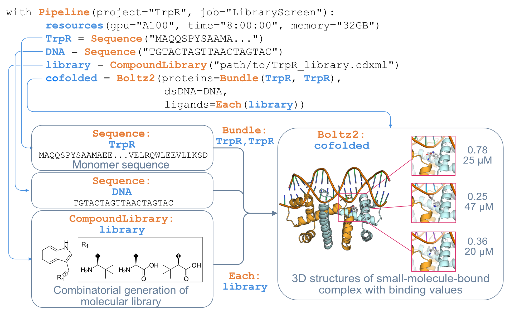

# BioPipelines

## Overview

A Python framework for automated computational protein design workflows that can run in Jupyter/Colab notebooks as well as on SLURM-based computing clusters. BioPipelines provides standardized interfaces to connect bioinformatics tools.

## Example: Inverse Folding Pipeline

  

## Example: Compound Library Screening with Boltz2

  

## Example Pipelines

| Notebook | Description | Tools |
|----------|-------------|-------|
|  **Inverse Folding** | Inverse folding of ubiquitin, AlphaFold2 refolding, RMSD/pLDDT filter, codon optimisation for *E. coli* | ProteinMPNN · AlphaFold · DNAEncoder |
|  **Kinase LID Redesign** | De novo backbone design of the adenylate kinase LID domain, filtered by RMSD on the fixed scaffold | RFdiffusion · ProteinMPNN · AlphaFold · ConformationalChange |
|  **FRET Biosensor Design** | Linker length optimisation for a Ca²⁺-responsive EBFP–CaM–EYFP FRET sensor | Fuse · Boltz2 · Distance · Panda · Plot · PyMOL |
|  **Compound Library Screening** | SAR screening of a compound library against a protein–DNA complex; affinities plotted by substituent | Boltz2 · CompoundLibrary · Panda · Plot |
|  **Iterative Binding Optimization** | 5-cycle directed evolution loop to improve ligand binding affinity via LigandMPNN + Boltz2 | Boltz2 · LigandMPNN · DistanceSelector · MutationProfiler · MutationComposer |
|  **Boltz2 Showcase** | All Boltz2 input modes: sequences, PDB, ligands, DNA, glycosylation, covalent linkages, Bundle/Each combinatorics | Boltz2 · CompoundLibrary · Bundle · Each |

## Documentation

Full documentation is available at **[biopipelines.readthedocs.io](https://biopipelines.readthedocs.io/en/latest/)**.

- **[User Manual](Docs/UserManual.md)**
- **[Tool Reference](Docs/ToolReference.md)**
- **[Examples](ExamplePipelines/)**
- **[Developer Manual](Docs/DeveloperManual.md)**
